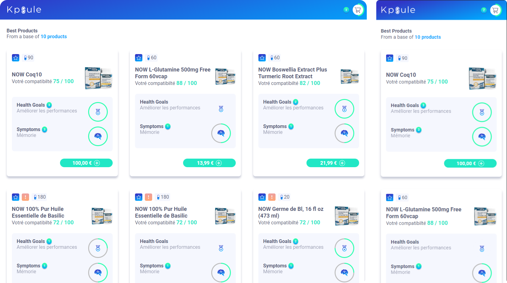
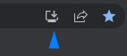

<h1 align=center>
  
</h1>

<div align="center" style="margin-top: 30px;">  
    <a href="https://pt-br.reactjs.org/docs/getting-started.html" target="_blank"  rel="noopener noreferrer">
         &nbsp;&nbsp;
    <a href="https://nextjs.org/docs/getting-started" target="_blank"  rel="noopener noreferrer" >
        
    </a>&nbsp;&nbsp;
     <a href="https://www.typescriptlang.org/" target="_blank"  rel="noopener noreferrer" >
        
    </a>&nbsp;&nbsp;
     <a href="https://styled-components.com/" target="_blank"  rel="noopener noreferrer" >
        
    </a>&nbsp;&nbsp;
</div>

<h4 align=center>
  <a href="#notebook-about">About</a>&nbsp;&nbsp;&nbsp;|&nbsp;&nbsp;&nbsp;
  <a href="#hammer-technologies">Technologies</a>&nbsp;&nbsp;&nbsp;|&nbsp;&nbsp;&nbsp;
  <a href="#black_nib-getting-started">Getting Started</a>&nbsp;&nbsp;&nbsp;|&nbsp;&nbsp;&nbsp;
  <a href="#heavy_plus_sign-upgrades">Upgrades</a>
</h4>

<br>


# :notebook: About

<h2>
  This is a PWA app: </br>
  Can be accessed on <a href="https://kpsule-project-aa69.vercel.app/">Kpsule Project URL</a> </br>
  To install PWA Desktop -> 
</h2>


Project created based on Create Next App with Typescript </br>
Design template base: [Figma Proto](https://www.figma.com/file/tAcUO4he80CxDqN032yaxz/Frontend-Test?node-id=0%3A1)

This project consume data from Next API routes as a Serveless client. [API routes](https://nextjs.org/docs/api-routes/introduction). </br>
The `pages/api` directory is mapped to `/api/*`. Files in this directory are treated as [API routes](https://nextjs.org/docs/api-routes/introduction) instead of React pages.

Endpoint: [http://localhost:3000/api/productList](http://localhost:3000/api/productList). </br>
This endpoint can be edited in <i><kbd> [pages/api/productList.ts](./src/pages/api/productList.ts) </kbd></i>

# :hammer: Technologies

#### 📃 Dependencies: -> <i><kbd> [package.json](./package.json) </kbd></i>

- [x] <b>[React Js](https://reactjs.org/):</b> <i>JS Lib to build interface</i>
- [x] <b>[Typescript](https://www.typescriptlang.org/):</b> <i>It's written in TypeScript</i>
- [x] <b>[Next Js](https://nextjs.org/docs/getting-started):</b> <i>Project creation tool </i>
- [x] <b>[Styled Components](https://styled-components.com/):</b> <i>Best tool to powerful our styles</i>
- [x] <b>[Axios](https://axios-http.com/docs/intro):</b> <i>Best lib to manage Rest API's </i>
- [x] <b>[React Loading Skeleton](https://www.npmjs.com/package/react-loading-skeleton):</b> <i>Lib to easier create Loading Skeleton effect </i>

# :black_nib: Getting Started

If you want to run this app on your dev workspace, look that:

You must have installed:

1. **Node.js**. <i>[Here](https://nodejs.org/en/)</i>
2. **GIT**. <i>[Here](https://git-scm.com)</i>

Downloading dependencies:

```bash
  $ npm install

  # or

  $ yarn
```

:fire: Once dependencies download, just run your start command :

```bash
  $ npm dev

  # or

  $ yarn dev
```

This is a [Next.js](https://nextjs.org/) project bootstrapped with [`create-next-app`](https://github.com/vercel/next.js/tree/canary/packages/create-next-app).

You can start editing the page by modifying `pages/index.tsx`. The page auto-updates as you edit the file.

## Learn More

To learn more about Next.js, take a look at the following resources:

- [Next.js Documentation](https://nextjs.org/docs) - learn about Next.js features and API.
- [Learn Next.js](https://nextjs.org/learn) - an interactive Next.js tutorial.

You can check out [the Next.js GitHub repository](https://github.com/vercel/next.js/) - your feedback and contributions are welcome!

## Deploy on Vercel

The easiest way to deploy your Next.js app is to use the [Vercel Platform](https://vercel.com/new?utm_medium=default-template&filter=next.js&utm_source=create-next-app&utm_campaign=create-next-app-readme) from the creators of Next.js.

Check out our [Next.js deployment documentation](https://nextjs.org/docs/deployment) for more details.

# :heavy_plus_sign: Upgrades:

Some features are available to upgrade this app, those are:

- [ ] Complete Theme Switcher to Dark Theme (base has been created);
- [ ] Create Cart drawer component to see products added

<p align=center> 
  <h6 align=center>💙 Made by 💙</h6> 
  <h2 align=center>
  <a href="https://www.linkedin.com/in/gama-leal">  
    
    Moacir Gama
  </a>
  </h2>
</p>
